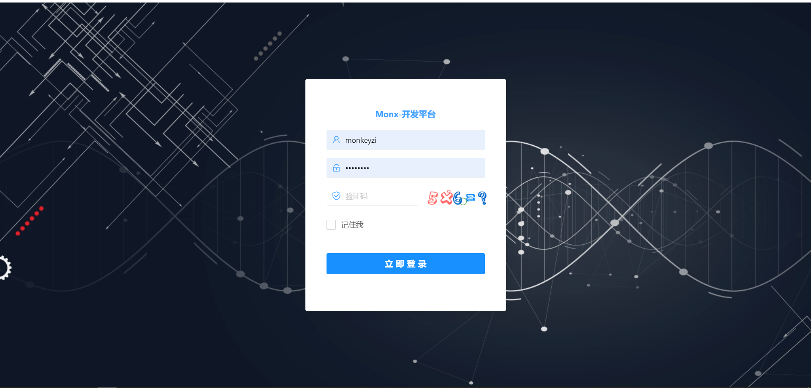
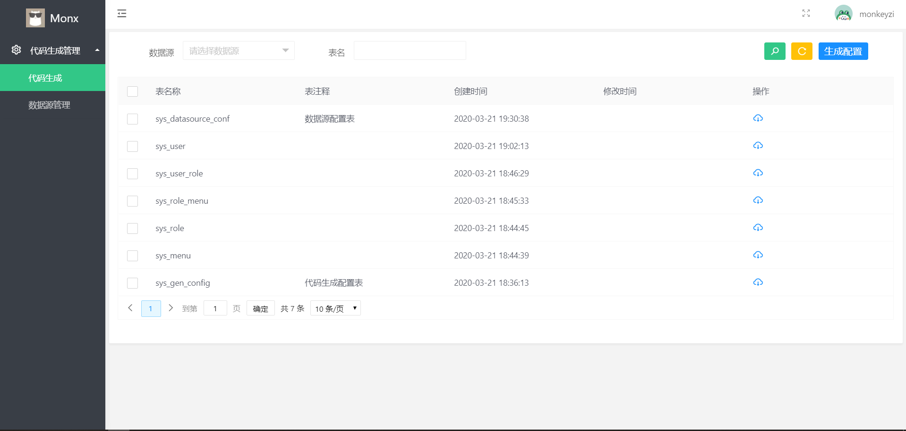
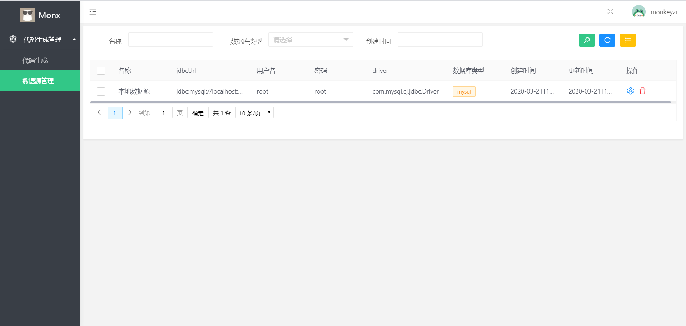
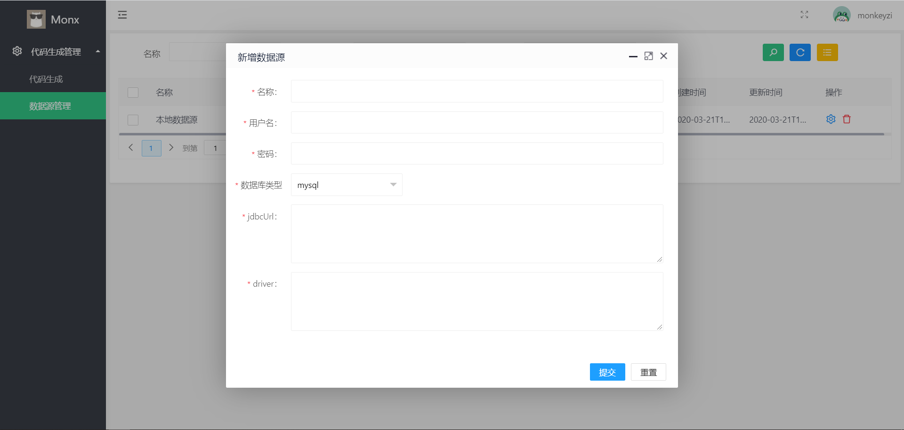
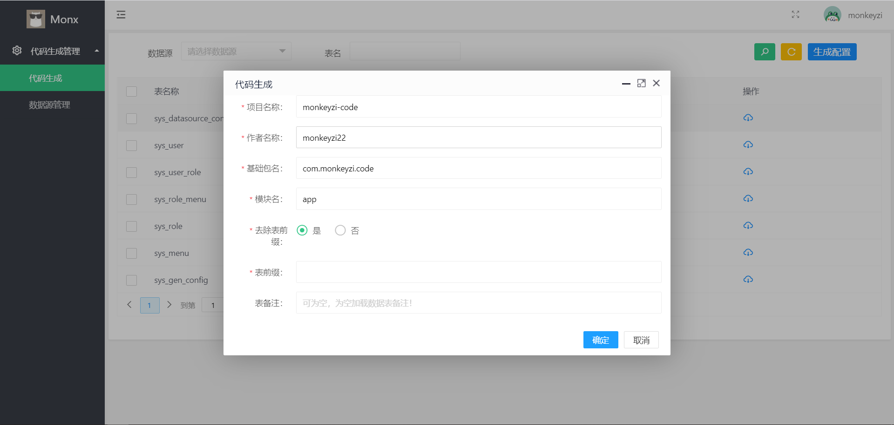

### 项目简介
#### code-gen代码生成


code-gen项目是使用springboot,mybatis-plus,layui等实现的一款动态数据源代码生成项目，
目前主要实现了动态数据源的管理，以及基于动态数据源实现代码生成，支持**oracle和mysql**两个数据库，
可以在基础上自己实现其他数据库代码生成管理，也可以利用按照自己公司的代码规范二次优化开发

####  项目演示地址

[http://code.gaoyanguo.com](http://code.gaoyanguo.com)

演示环境账号密码：

 账号 | 密码
 ---|---
 monkeyzi | 1qaz2wsx 


#### 后续版本
当前分支为1.0版本，后续有时间会优化完成更多功能

#### 系统模块
系统功能模块组成如下所示：
```
├─代码生成管理
│  ├─代码生成
│  ├─数据源管理


```
#### 系统特点

1. 动态数据源代码生成

2. 支持mysql,oracle数据库

3. 前端页面布局多样化，主题多样化

4. 浏览器兼容性好，页面支持PC，Pad和移动端。

5. 代码简单，结构清晰


### 系统截图

#### PC端







### 浏览器兼容
|[](http://godban.github.io/browsers-support-badges/)</br>IE| [](http://godban.github.io/browsers-support-badges/)</br>Edge | [](http://godban.github.io/browsers-support-badges/)</br>Firefox | [](http://godban.github.io/browsers-support-badges/)</br>Chrome | [](http://godban.github.io/browsers-support-badges/)</br>Safari |[](http://godban.github.io/browsers-support-badges/)</br>Opera
| --------- | --------- | --------- | --------- | --------- |--------- |
|IE 10+| Edge| last 15 versions| last 15 versions| last 10 versions| last 15 versions

#### 前端页面来源

<a href="https://github.com/wuyouzhuguli/FEBS-Shiro">FEBS-Shiro</a>

<a href="https://github.com/wuyouzhuguli/FEBS-Shiro">FEBS-Shiro github地址</a>

#### 联系作者
- qq：854152531 加我请备注 **"代码生成"**
#### 支持作者
如果该系统对您有帮助的话，请作者喝杯柠檬水吧🍺~


